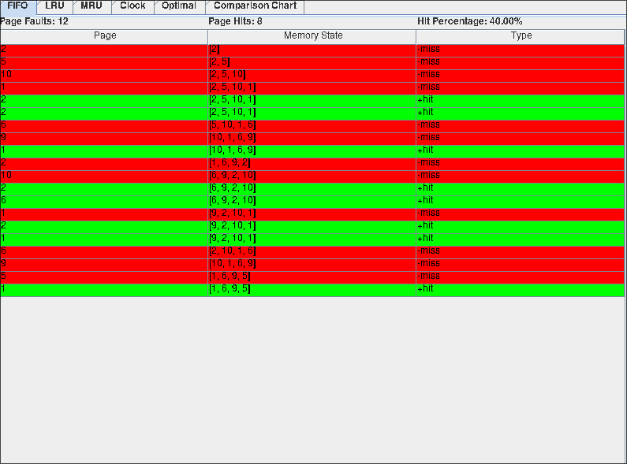
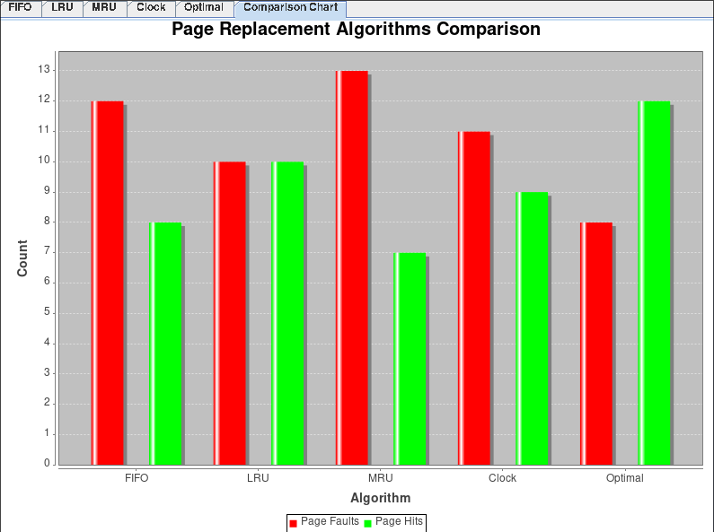

# Simulador de Algoritmos de Substituição de Páginas

Este projeto implementa um simulador de algoritmos de substituição de páginas com uma interface gráfica, utilizando Java Swing e a biblioteca de gráficos JFreeChart. O simulador permite comparar visualmente o desempenho de diferentes algoritmos de substituição de páginas (*Page Replacement Algorithms*) ao simular o processo de carregamento de páginas em uma memória com capacidade limitada.

## Algoritmos Implementados

- **FIFO** (First-In, First-Out)
- **LRU** (Least Recently Used)
- **MRU** (Most Recently Used)
- **Clock**
- **Ótimo**

## Funcionalidades

- Visualização de cada passo do algoritmo para uma lista de páginas.
- Destaque visual para *page hits* e *page faults*.
- Comparação gráfica entre os algoritmos para a quantidade de *page faults* e *page hits*.
- Cálculo de estatísticas como percentual de *hits* para cada algoritmo.

## Pré-requisitos

- **Java**: versão 21 ou superior
- **Apache Maven**: versão 3.6 ou superior

## Instalação e Execução

### 1. Clonar o Repositório

Clone o repositório para o seu ambiente local usando o comando:

```bash
git clone https://github.com/clys-man/page-replacement-algorithms.git
cd page-replacement-algorithms
```

### 2. Compilar e Executar com Maven

O Maven gerencia as dependências do projeto, incluindo a biblioteca **JFreeChart**.

- Para compilar o projeto e resolver as dependências, execute:

  ```bash
  mvn clean compile
  ```

- Para executar o simulador:

  ```bash
  mvn exec:java -Dexec.mainClass="me.clysman.unifor.PageReplacementSimulator"
  ```

### 3. Construir um Pacote JAR Executável (Opcional)

Para construir um pacote JAR executável que inclui todas as dependências:

```bash
mvn package
```

O arquivo JAR gerado estará em `target/PageReplacementSimulator-1.0-SNAPSHOT.jar`. Execute o JAR com o comando:

```bash
java -jar target/PageReplacementSimulator-1.0-SNAPSHOT.jar
```

## Dependências

O projeto utiliza a biblioteca **JFreeChart** para a geração de gráficos.

```xml
<dependencies>
   <dependency>
      <groupId>jfree</groupId>
      <artifactId>jfreechart</artifactId>
      <version>1.0.13</version>
   </dependency>
</dependencies>
```

## Capturas de Tela

### Interface Principal
- Tabela mostrando passos do algoritmo com células em verde para *hits* e em vermelho para *misses*.




### Gráfico Comparativo
- Gráfico de barras exibindo a quantidade de *page faults* e *page hits* para cada algoritmo.


